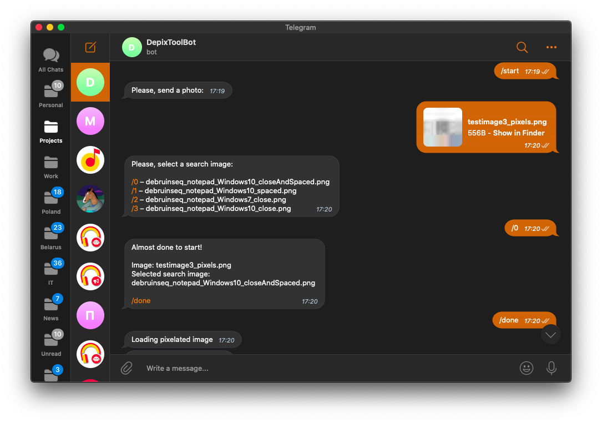
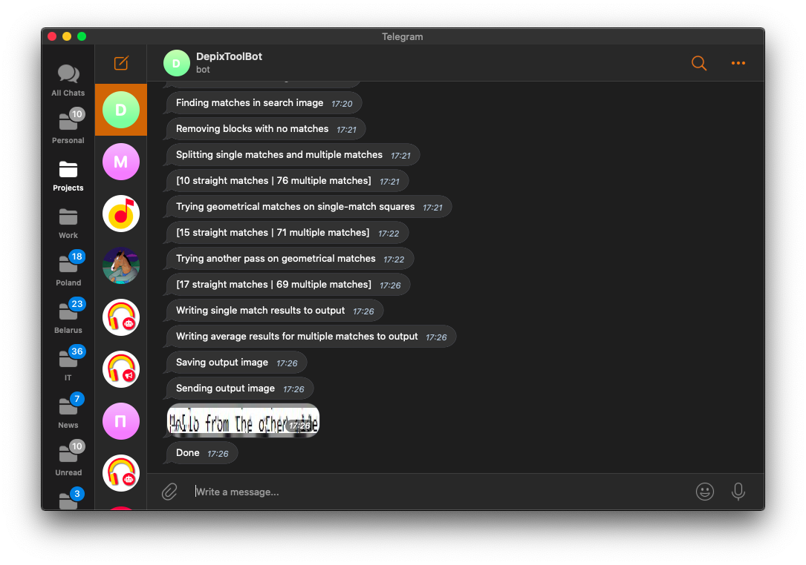

# DepixToolBot for Telegram
### Depix as self-hosted solution with the UI of messenger

This is not a multi-user solution! Searching for matches in search images
 is a difficult CPU bound task which can take **more than 30 minutes**
  to complete on weak servers!

[Depix](https://github.com/beurtschipper/Depix) is a tool for recovering 
passwords from pixelized screenshots 
by [beurtschipper](https://github.com/beurtschipper).

Article about background information on pixelization and similar research:
- [English](https://www.linkedin.com/pulse/recovering-passwords-from-pixelized-screenshots-sipke-mellema)
- [Russian](https://habr.com/ru/company/vdsina/blog/532764/)


## How to install

Python 3 + pip should be installed.

Get source code:
```shell script
git clone git@github.com:MarshalX/DepixToolBot.git
cd DepixToolBot
```

Install dependencies:
- pipenv way
```shell script
pipenv install
```
- pip way
```
pip3 install -r requirements.txt
```

Create .env file and fill vars values:
```
cp .env.example .env
```

Env vars explanation:
- `BOT_TOKEN` - token from @BotFather of Telegram.
- `DEPIX_SEARCH_IMAGES_PATH` - path for a folder with search images.

Export envs from a file:
```shell script
export $(grep -v '^#' .env | xargs)
```

Run bot:
```shell script
python3 main.py
```
## Screenshots




## Licence

This work is licensed under a Creative Commons Attribution 4.0 International 
License. To view a copy of this license, 
visit https://creativecommons.org/licenses/by/4.0/.